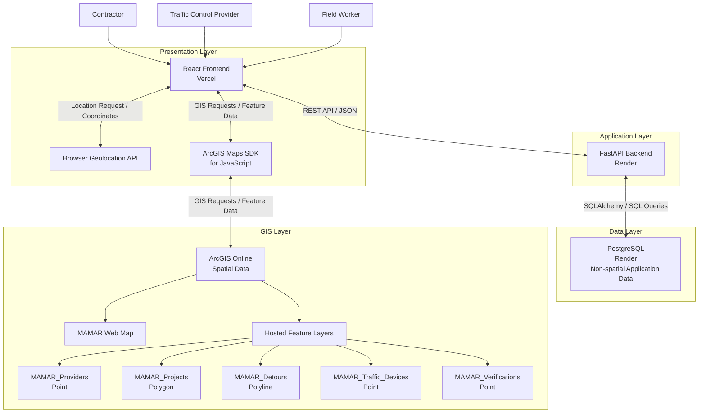
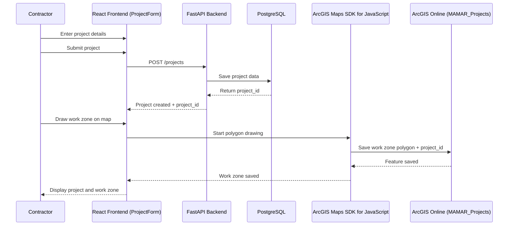
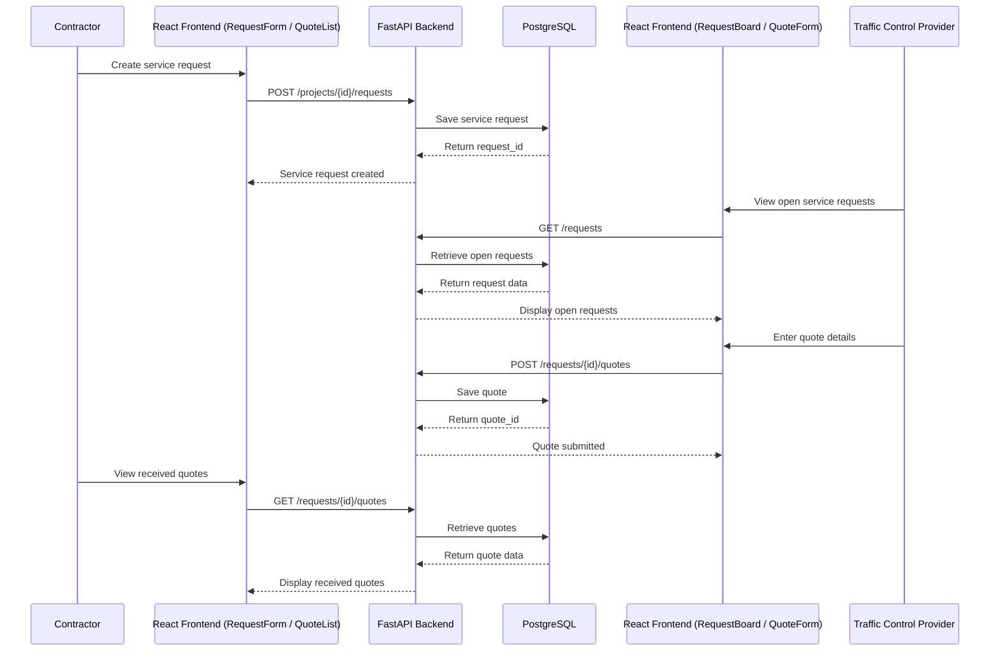
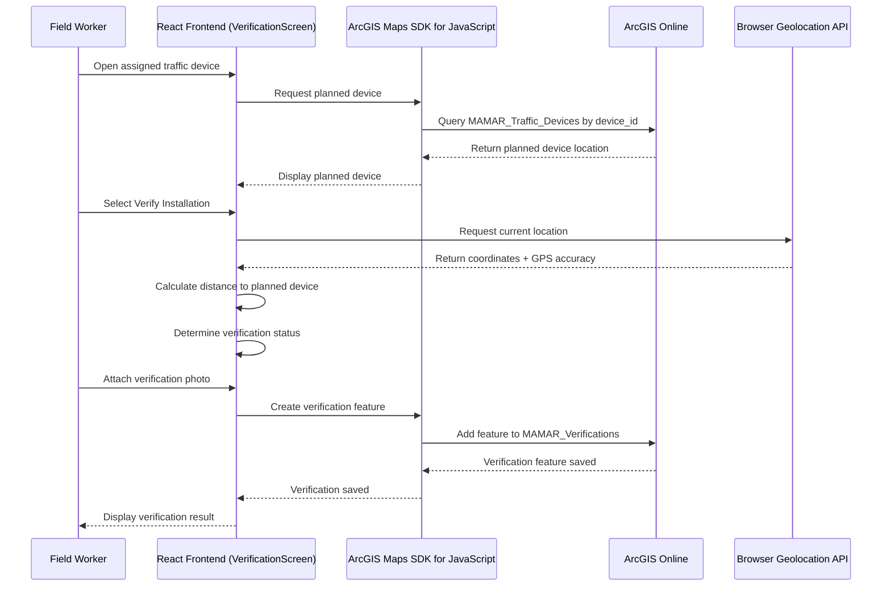

# MAMAR – Technical Documentation 

## Project Overview

MAMAR is a geospatial B2B platform for temporary traffic control operations. It connects contractors with traffic control service providers and uses GIS to support project location management, service requests, field execution, and location-based verification of temporary traffic control devices.

This document contains the technical documentation for Stage 3 of the MAMAR project, including user stories and mockups, system architecture, component and database design, sequence diagrams, API documentation, and SCM and QA strategies.

---

# Task 0 – Define User Stories and Mockups

User Stories

The following user stories define and prioritize the main functionalities of the MAMAR MVP from the perspectives of contractors, traffic-control providers, and field workers.

| ID | User Story | MoSCoW Priority |
|---|---|---|
| US01 | As a contractor, I want to create a project, so that I can define my temporary traffic-control requirements. | Must Have |
| US02 | As a contractor, I want to define the project work zone on a map, so that the project location can be geographically documented. | Must Have |
| US03 | As a contractor, I want to request traffic-control services, so that qualified providers can submit quotations for my project. | Must Have |
| US04 | As a contractor, I want to review and compare provider quotations, so that I can select a suitable provider. | Must Have |
| US05 | As a traffic-control provider, I want to view service requests and submit quotations, so that I can offer my services to contractors. | Must Have |
| US06 | As a traffic-control provider, I want to manage assigned projects and field execution, so that project activities can be documented. | Must Have |
| US07 | As a field worker, I want to capture my current location when verifying an installed traffic-control device, so that its installation location can be compared with its planned location. | Must Have |
| US08 | As a field worker, I want to attach an installation photo, so that field evidence can be recorded with the verification. | Should Have |
| US09 | As a contractor, I want to monitor project execution and verification status, so that I can follow the progress of my project. | Should Have |
| US10 | As a contractor, I want to review the provider's final project submission, so that I can confirm project completion. | Could Have |

Won't Have in the MVP

The following functionalities are outside the scope of the current MVP:

- Online payment integration
- Continuous GPS tracking
- Government permit approval
- Automatic Traffic Control Plan approval
- Real-time vehicle or worker tracking

UI/UX Mockups

The MAMAR user interface was designed in Figma to visualize the main workflows for contractors, traffic-control providers, and field workers.

The mockups cover the main MVP screens, including:

- Landing and authentication
- Contractor dashboard
- Project creation
- GIS-based work-zone selection
- Traffic-control service selection
- Provider matching
- Quotations and provider selection
- Project monitoring
- Provider dashboard and field execution
- Device installation verification
- Project completion and contractor review

View MAMAR UI/UX Design in Figma:
(https://www.figma.com/design/X55NZXhkUJMgvVBJvXdE7k/MAMAR?node-id=0-1&t=RwGuPAq0YCEA78Ad-1)

---

# Task 1 – Design System Architecture

## 1.1 Architecture Overview

MAMAR follows a layered architecture that separates the user interface, application logic, non-spatial application data, and spatial GIS data.

The system consists of:

- **Frontend:** React, deployed on Vercel.
- **Backend:** FastAPI, deployed on Render.
- **Database:** PostgreSQL on Render for non-spatial application data.
- **GIS Platform:** ArcGIS Online for spatial data, the MAMAR Web Map, and Hosted Feature Layers.
- **GIS Integration:** ArcGIS Maps SDK for JavaScript.
- **Location Capture:** Browser Geolocation API.

The main system users are:

- Contractor
- Traffic Control Provider
- Field Worker

## 1.2 System Architecture

The following diagram illustrates the high-level architecture of the MAMAR platform and the interaction between its main components.

## 1.3 Data Flow

The React frontend communicates with the FastAPI backend through a REST API using JSON.

FastAPI communicates with PostgreSQL through SQLAlchemy and SQL queries. PostgreSQL stores the non-spatial application data.

Spatial data is managed separately in ArcGIS Online. The React frontend interacts with ArcGIS Online through the ArcGIS Maps SDK for JavaScript.

The Browser Geolocation API communicates directly with the React frontend to provide the field worker's current coordinates when location verification is requested.

There is no direct connection between FastAPI and ArcGIS Online in the current architecture.

## 1.4 GIS Architecture

ArcGIS Online stores the MAMAR Web Map and the following five Hosted Feature Layers:

- `MAMAR_Providers` – Point
- `MAMAR_Projects` – Polygon
- `MAMAR_Detours` – Polyline
- `MAMAR_Traffic_Devices` – Point
- `MAMAR_Verifications` – Point

The MAMAR Web Map provides the configured map visualization, while the Hosted Feature Layers store and manage the spatial features used by the application.

---

# Task 2 – Define Components, Classes, and Database Design

> To be added.

---

# Task 3 – Create High-Level Sequence Diagrams

The following sequence diagrams illustrate three critical use cases in the MAMAR platform and show the interactions between users and the main system components.

## 3.1 Create Project and Define Work Zone

This sequence shows how a contractor creates a new project and defines its geographic work zone.

The project information is first created through the FastAPI backend and stored in PostgreSQL. After receiving the generated `project_id`, the contractor defines the work zone on the map. The polygon is then stored in the `MAMAR_Projects` Hosted Feature Layer in ArcGIS Online using the same `project_id`.

## 3.2 Request Traffic Control Service and Receive Provider Quote

This sequence shows how a contractor creates a traffic control service request and how a traffic control provider responds with a quotation.

The service request and quotation information are handled through the FastAPI REST API and stored as non-spatial application data in PostgreSQL.

## 3.3 Verify Traffic Device Installation

This sequence shows how a field worker verifies that a traffic control device has been installed at its planned geographic location.

The application retrieves the planned device from `MAMAR_Traffic_Devices`. When the worker starts verification, the Browser Geolocation API provides the current coordinates and GPS accuracy.

The application calculates the distance between the captured location and the planned device location, determines the verification status, and stores the verification record in `MAMAR_Verifications`.

---

# Task 4 – Document External and Internal APIs

> To be added.

---

# Task 5 – Plan SCM and QA Strategies

This section defines the Software Configuration Management (SCM) and Quality Assurance (QA) strategies that will be used during the development of MAMAR.

The goal is to maintain an organized development workflow, protect the stability of the main codebase, and ensure that the core features of the platform work correctly before deployment.

## 5.1 Software Configuration Management (SCM)

MAMAR will use Git for version control and GitHub for repository management and team collaboration.

### Branching Strategy

The project will use the following branch structure:

- `main`: Contains the stable and deployment-ready version of the application.
- `development`: Used to integrate completed features before they are merged into `main`.
- `feature/*`: Used by team members to develop individual features or tasks.

Examples:

- `feature/authentication`
- `feature/project-management`
- `feature/gis-map`
- `feature/service-requests`
- `feature/quotations`
- `feature/device-verification`

The development workflow will be:

`feature branch → development → main`

Team members will create a feature branch for their assigned work. After the feature is completed and tested, a Pull Request will be created to merge it into the `development` branch.

After integration testing and review, stable changes will be merged from `development` into `main`.

### Commits

Team members will make regular commits with clear and descriptive commit messages.

Examples:

- `Add project creation form`
- `Implement service request endpoint`
- `Integrate ArcGIS Web Map`
- `Add device verification workflow`
- `Fix quotation validation`

Commits should focus on a specific change whenever possible to make the project history easier to understand and maintain.

### Pull Requests and Code Reviews

Changes should not be merged directly into `main`.

For each completed feature:

1. The developer pushes the feature branch to GitHub.
2. A Pull Request is created to merge the feature into `development`.
3. Another team member reviews the code.
4. Required corrections are made if necessary.
5. The feature is merged after review and successful testing.
6. Stable and tested changes are later merged from `development` into `main`.

The review should check:

- Code readability and organization.
- Correct implementation of the required feature.
- Compatibility with existing functionality.
- Error handling and input validation.
- No exposed passwords, API keys, tokens, or other secrets.
- No unnecessary or unrelated changes.

## 5.2 Quality Assurance (QA)

MAMAR will use a combination of automated and manual testing.

Testing will focus on the critical workflows of the MVP across the React frontend, FastAPI backend, PostgreSQL database, and ArcGIS Online GIS components.

### Unit Testing

Unit tests will be used for individual backend functions and business logic where appropriate.

Backend tests will use `pytest`.

Examples include:

- User authentication logic.
- Project validation.
- Service request logic.
- Quote creation and validation.
- Quote acceptance logic.
- Assignment logic.

### API Testing

The FastAPI REST API endpoints will be tested using Postman and FastAPI's interactive API documentation.

Testing will verify:

- Correct HTTP methods.
- Correct request parameters and JSON bodies.
- Expected response structure.
- Appropriate HTTP status codes.
- Input validation.
- Authentication and authorization where required.
- Error handling.

Important API workflows to test include:

- User registration and login.
- Creating and updating projects.
- Creating service requests.
- Retrieving service requests.
- Submitting and retrieving quotations.
- Awarding a quotation.
- Creating and retrieving assignments.

### Integration Testing

Integration testing will verify that the main components of MAMAR work correctly together.

The following integrations will be tested:

- React frontend ↔ FastAPI backend.
- FastAPI backend ↔ PostgreSQL.
- React frontend ↔ ArcGIS Maps SDK for JavaScript.
- ArcGIS Maps SDK for JavaScript ↔ ArcGIS Online.
- React frontend ↔ Browser Geolocation API.

Shared IDs such as `project_id`, `provider_id`, `worker_id`, and `device_id` will also be checked to ensure that application records correspond correctly with GIS features.

### GIS Functional Testing

The GIS functionality will be manually tested to confirm that the MAMAR Web Map and Hosted Feature Layers behave correctly.

Testing will include:

- Loading the MAMAR Web Map.
- Displaying the five GIS layers.
- Displaying the saved map symbology and labels.
- Creating and updating project polygons.
- Creating and updating detour polylines.
- Creating and updating traffic-device points.
- Querying provider locations.
- Creating verification points.
- Confirming that GIS edits persist after refreshing the application.

The five GIS layers are:

- `MAMAR_Providers`
- `MAMAR_Projects`
- `MAMAR_Detours`
- `MAMAR_Traffic_Devices`
- `MAMAR_Verifications`

### Device Verification Testing

The device verification workflow is one of the critical GIS workflows and will be tested separately.

The test will verify that:

1. The planned traffic device can be retrieved from `MAMAR_Traffic_Devices`.
2. The Browser Geolocation API can request the field worker's current location after permission is granted.
3. The application receives the current coordinates and GPS accuracy.
4. The distance between the planned device and captured worker location can be calculated.
5. A verification status can be determined based on the verification logic.
6. The verification record can be stored in `MAMAR_Verifications`.
7. The saved verification can be displayed again from ArcGIS Online.

Photo handling will be tested according to the final photo-storage method selected during MVP implementation.

### Manual User Flow Testing

Critical user workflows will also be tested manually from the user interface.

#### Contractor Flow

`Create Project → Define Work Zone → Select Required Services → Request Quotations → Review Quotations → Accept a Quotation → Monitor Project Execution`

#### Traffic Control Provider Flow

`View Service Requests → Submit Quotation → View Awarded Project → Assign Field Worker → Manage Execution → Update Project Progress`

#### Field Worker Flow

`Open Assigned Device → Capture Current Location → Add Installation Evidence → Verify Installation`

These tests will confirm that the system works from the user's perspective and not only at the individual component level.

## 5.3 Deployment and Testing Pipeline

MAMAR will use separate development and production stages.

The planned deployment flow is:

`Feature Development → Code Review → Development Integration → Testing → Main Branch → Production Deployment`

The deployment platforms are:

- **Frontend:** Vercel
- **Backend:** Render
- **Database:** PostgreSQL on Render
- **GIS Services:** ArcGIS Online

During development, new features will first be tested before being merged into `main`.

After the changes pass code review and the required tests, the stable version will be merged into `main` and deployed to the production environment.

Environment variables will be used for configuration values and sensitive credentials. `.env` files and secrets will not be committed to GitHub.

## 5.4 QA Acceptance Criteria

A feature will be considered ready for integration when:

- The required functionality works as expected.
- Relevant tests pass.
- The feature does not break existing core functionality.
- API responses and error cases have been checked where applicable.
- GIS functionality has been verified where applicable.
- No sensitive credentials are exposed in the repository.
- The code has been reviewed before integration.

A release will be considered ready for production when the critical MAMAR user flows have been successfully tested and no blocking issues remain.

---

# Stage 3 Deliverables

The final Stage 3 technical documentation includes:

- Task 0 – User Stories and Mockups
- Task 1 – System Architecture
- Task 2 – Components, Classes, and Database Design
- Task 3 – High-Level Sequence Diagrams
- Task 4 – External and Internal APIs
- Task 5 – SCM and QA Strategies
