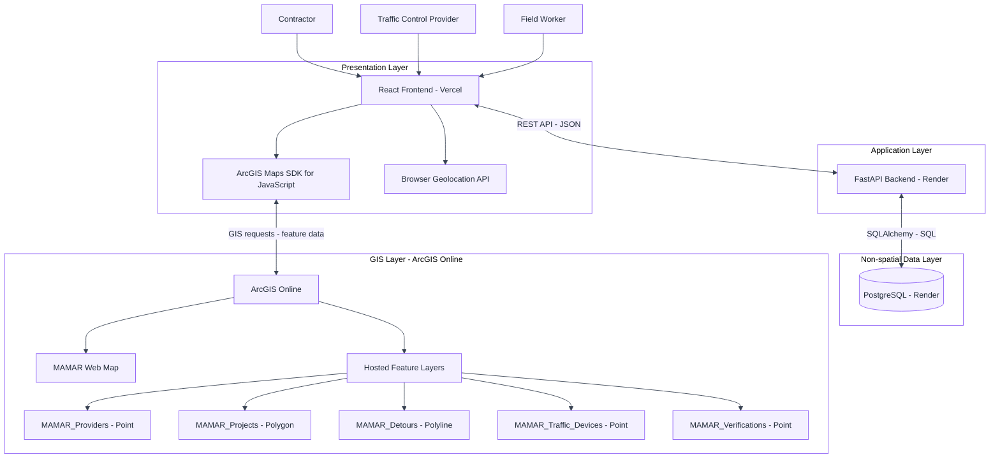
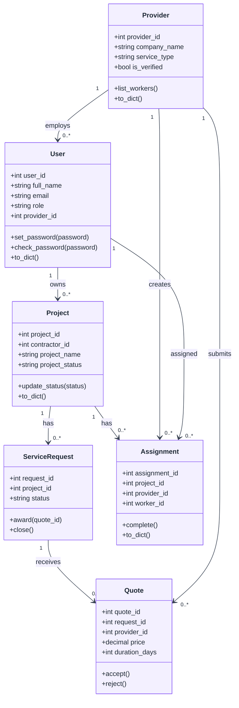
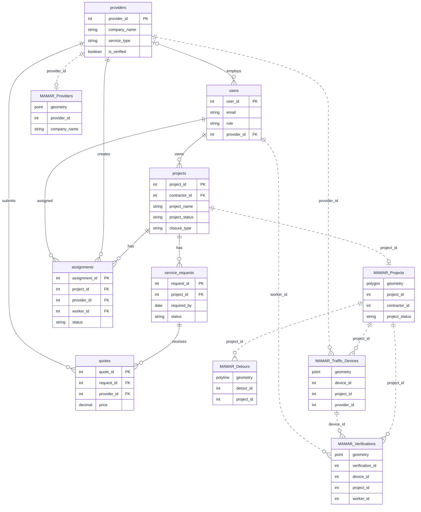
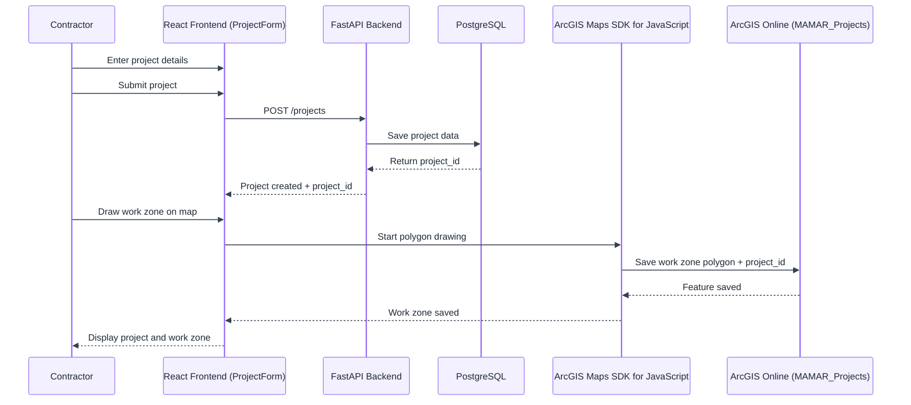
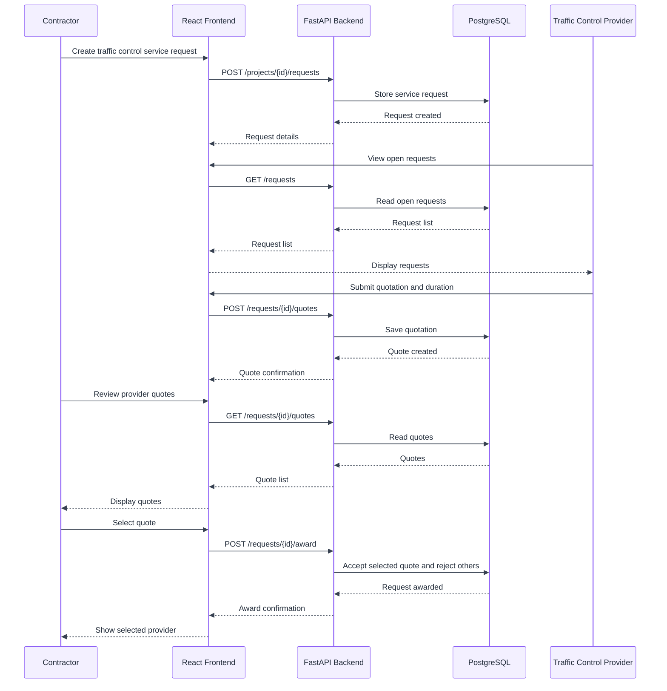
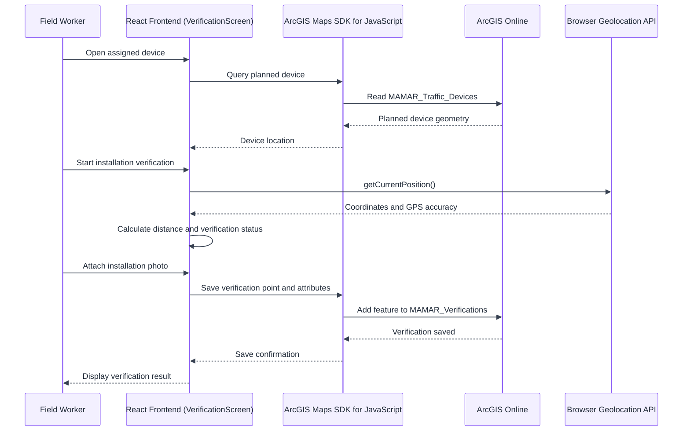

# MAMAR – Technical Documentation

## Project Overview

MAMAR is a geospatial B2B platform for temporary traffic control operations. It connects contractors with traffic control service providers and uses GIS to support project location management, service requests, field execution, and location-based verification of temporary traffic control devices.

This document contains the technical documentation for Stage 3 of the MAMAR project, including user stories and mockups, system architecture, component and database design, sequence diagrams, API documentation, and SCM and QA strategies.

---

# Task 0 – Define User Stories and Mockups

## User Stories

The following user stories define and prioritize the main functionalities of the MAMAR MVP from the perspectives of contractors, traffic-control providers, and field workers.

| **ID** | **User Story**                                                                                                                                                                            | **MoSCoW Priority** |
| ------ | ----------------------------------------------------------------------------------------------------------------------------------------------------------------------------------------- | ------------------- |
| US01   | As a contractor, I want to create a project, so that I can define my temporary traffic-control requirements.                                                                              | Must Have           |
| US02   | As a contractor, I want to define the project work zone on a map, so that the project location can be geographically documented.                                                          | Must Have           |
| US03   | As a contractor, I want to request traffic-control services, so that qualified providers can submit quotations for my project.                                                            | Must Have           |
| US04   | As a contractor, I want to review and compare provider quotations, so that I can select a suitable provider.                                                                              | Must Have           |
| US05   | As a traffic-control provider, I want to view service requests and submit quotations, so that I can offer my services to contractors.                                                     | Must Have           |
| US06   | As a traffic-control provider, I want to manage assigned projects and field execution, so that project activities can be documented.                                                      | Must Have           |
| US07   | As a field worker, I want to capture my current location when verifying an installed traffic-control device, so that its installation location can be compared with its planned location. | Must Have           |
| US08   | As a field worker, I want to attach an installation photo, so that field evidence can be recorded with the verification.                                                                  | Should Have         |
| US09   | As a contractor, I want to monitor project execution and verification status, so that I can follow the progress of my project.                                                            | Should Have         |
| US10   | As a contractor, I want to review the provider's final project submission, so that I can confirm project completion.                                                                      | Could Have          |

Won't Have in the MVP

The following functionalities are outside the scope of the current MVP:

- Online payment integration
- Continuous GPS tracking
- Government permit approval
- Automatic Traffic Control Plan approval
- Real-time vehicle or worker tracking

## UI/UX Mockups

The MAMAR user interface was designed in Figma to visualize the main workflows for contractors, traffic-control providers, and field workers.

The mockups cover the main MVP screens, including:

- Landing and authentication
- Contractor dashboard
- Project creation
- GIS-based work-zone selection
- Traffic-control service selection
- Provider matching
- Quotations and provider selection
- Project monitoring
- Provider dashboard and field execution
- Device installation verification
- Project completion and contractor review

**The complete interactive UI/UX design is available for further review:**

[View MAMAR UI/UX Design in Figma](https://www.figma.com/design/X55NZXhkUJMgvVBJvXdE7k/MAMAR?node-id=0-1\&t=RwGuPAq0YCEA78Ad-1)

---

# Task 1 – Design System Architecture

## 1.1 Architecture Overview

MAMAR follows a layered architecture that separates the user interface, application logic, non-spatial application data, and spatial GIS data.

The system consists of:

- **Frontend:** React, deployed on Vercel.
- **Backend:** FastAPI, deployed on Render.
- **Database:** PostgreSQL on Render for non-spatial application data.
- **GIS Platform:** ArcGIS Online for spatial data, the MAMAR Web Map, and Hosted Feature Layers.
- **GIS Integration:** ArcGIS Maps SDK for JavaScript.
- **Location Capture:** Browser Geolocation API.

The main system users are:

- Contractor
- Traffic Control Provider
- Field Worker

## 1.2 System Architecture

The following diagram illustrates the high-level architecture of the MAMAR platform and the interaction between its main components.



## 1.3 Data Flow

The React frontend communicates with the FastAPI backend through a REST API using JSON.

FastAPI communicates with PostgreSQL through SQLAlchemy and SQL queries. PostgreSQL stores the non-spatial application data.

Spatial data is managed separately in ArcGIS Online. The React frontend interacts with ArcGIS Online through the ArcGIS Maps SDK for JavaScript.

The Browser Geolocation API communicates directly with the React frontend to provide the field worker's current coordinates when location verification is requested.

There is no direct connection between FastAPI and ArcGIS Online in the current architecture.

## 1.4 GIS Architecture

ArcGIS Online stores the MAMAR Web Map and the following five Hosted Feature Layers:

- `MAMAR_Providers` – Point
- `MAMAR_Projects` – Polygon
- `MAMAR_Detours` – Polyline
- `MAMAR_Traffic_Devices` – Point
- `MAMAR_Verifications` – Point

The MAMAR Web Map provides the configured map visualization, while the Hosted Feature Layers store and manage the spatial features used by the application.

---

# Task 2 – Define Components, Classes, and Database Design

### 2.1 Overview

We split MAMAR's data between two places because the project has two very different kinds of data. Everything that is not on the map, like accounts, service requests, quotes and worker assignments, goes into PostgreSQL. Everything that has a location goes into ArcGIS Online as five Hosted Feature Layers. PostgreSQL and ArcGIS Online do not know about each other, so we keep them connected ourselves by using the same shared IDs on both sides: `project_id`, `provider_id`, `contractor_id`, `worker_id`, and `device_id`.

The table below shows which technology handles each part of the system.

| **Part**  | **Technology**              | **Responsibility**                                                                                                                            |
| --------- | --------------------------- | --------------------------------------------------------------------------------------------------------------------------------------------- |
| Front-end | React, deployed on Vercel   | All the pages. It also draws the map with the ArcGIS Maps SDK for JavaScript and reads the worker's position with the Browser Geolocation API |
| Back-end  | FastAPI, deployed on Render | REST API that returns JSON for users, projects, service requests, quotes, and assignments                                                     |
| Database  | PostgreSQL on Render        | Non-spatial application data. The back-end reaches it through SQLAlchemy                                                                      |
| GIS       | ArcGIS Online               | The MAMAR Web Map and the five Hosted Feature Layers                                                                                          |

### 2.2 Back-end Classes

Our back-end is a FastAPI application with six key classes. Each class is designed as a SQLAlchemy model, with a corresponding table in PostgreSQL. The back-end never touches the GIS layers. That part is done in the front-end with the ArcGIS Maps SDK. For each class below we describe what it represents, then list its attributes and its methods.

#### 2.2.1 User

A `User` is anyone who can sign in to MAMAR. That can be a contractor, an employee of a provider, a field worker or an admin. The `role` attribute tells us which one.

- **Attributes:** `user_id`, `full_name`, `email`, `password_hash`, `phone`, `role`, `provider_id`, `is_active`, `created_at`

| **Method**                 | **What it does**                                                                      |
| -------------------------- | ------------------------------------------------------------------------------------- |
| `set_password(password)`   | Hashes the new password and saves only the hash, so the real password is never stored |
| `check_password(password)` | Compares a password with the saved hash when the user logs in                         |
| `to_dict()`                | Returns the user as JSON, without the password hash                                   |

#### 2.2.2 Provider

A `Provider` is a traffic control company. Providers are the ones who answer service requests with a quote.

- **Attributes:** `provider_id`, `company_name`, `service_type`, `city`, `phone`, `website`, `is_verified`, `created_at`

| **Method**       | **What it does**                                      |
| ---------------- | ----------------------------------------------------- |
| `list_workers()` | Returns the field workers that work for this provider |
| `to_dict()`      | Returns the provider as JSON                          |

#### 2.2.3 Project

A `Project` is a road project that a contractor creates in MAMAR.

- **Attributes:** `project_id`, `contractor_id`, `project_name`, `project_status`, `closure_type`, `start_date`, `end_date`, `description`, `created_at`

| **Method**              | **What it does**                                                      |
| ----------------------- | --------------------------------------------------------------------- |
| `update_status(status)` | Moves `project_status` between draft, active, completed and cancelled |
| `to_dict()`             | Returns the project as JSON                                           |

#### 2.2.4 ServiceRequest

A `ServiceRequest` is what the contractor posts when a project needs traffic control work. Each request belongs to one project.

- **Attributes:** `request_id`, `project_id`, `title`, `details`, `required_by`, `status`, `created_at`

| **Method**        | **What it does**                                                                                                                                           |
| ----------------- | ---------------------------------------------------------------------------------------------------------------------------------------------------------- |
| `award(quote_id)` | The main operation for choosing a provider. It accepts the quote that the contractor picked, rejects all the other quotes and marks the request as awarded |
| `close()`         | Marks the request as closed when no more quotes are needed                                                                                                 |

#### 2.2.5 Quote

A `Quote` is the offer that a provider sends for a service request. It has a price and the number of days the work will take.

- **Attributes:** `quote_id`, `request_id`, `provider_id`, `price`, `duration_days`, `notes`, `status`, `created_at`

| **Method** | **What it does**                                                             |
| ---------- | ---------------------------------------------------------------------------- |
| `accept()` | Marks the quote as accepted. It is only called from inside `award(quote_id)` |
| `reject()` | Marks the quote as rejected. It is only called from inside `award(quote_id)` |

#### 2.2.6 Assignment

An `Assignment` records which field worker was sent to which project. The provider that won the request creates it after its quote is accepted.

- **Attributes:** `assignment_id`, `project_id`, `provider_id`, `worker_id`, `assigned_at`, `status`

| **Method**   | **What it does**                                                                   |
| ------------ | ---------------------------------------------------------------------------------- |
| `complete()` | Marks the assignment as completed when the worker finishes the assigned field work |
| `to_dict()`  | Returns the assignment as JSON                                                     |

#### 2.2.7 API Routers

The endpoints that use these classes are grouped into five routers. The details of every endpoint are in the API section of this document.

| **Router**    | **Main endpoints**                                                           | **Used by**                            |
| ------------- | ---------------------------------------------------------------------------- | -------------------------------------- |
| `auth`        | `POST /auth/register`, `POST /auth/login`                                    | All roles                              |
| `projects`    | `GET /projects`, `POST /projects`, `PATCH /projects/{id}`                    | Contractor                             |
| `requests`    | `POST /projects/{id}/requests`, `GET /requests`, `POST /requests/{id}/award` | Contractor, Traffic Control Provider   |
| `quotes`      | `POST /requests/{id}/quotes`, `GET /requests/{id}/quotes`                    | Traffic Control Provider, Contractor   |
| `assignments` | `POST /projects/{id}/assignments`, `GET /assignments`                        | Traffic Control Provider, Field Worker |

#### 2.2.8 Class Diagram



### 2.3 Database Schema (PostgreSQL)

MAMAR uses a relational database, PostgreSQL, with six tables. None of them stores geometry because all the geometry is in ArcGIS Online. In the tables below, PK means primary key and FK means foreign key.

#### 2.3.1 users

| **Column**      | **Type**     | **Constraints**                                       |
| --------------- | ------------ | ----------------------------------------------------- |
| `user_id`       | SERIAL       | PK                                                    |
| `full_name`     | VARCHAR(100) | NOT NULL                                              |
| `email`         | VARCHAR(255) | NOT NULL, UNIQUE                                      |
| `password_hash` | VARCHAR(255) | NOT NULL                                              |
| `phone`         | VARCHAR(20)  | Optional                                              |
| `role`          | VARCHAR(20)  | NOT NULL. One of: contractor, provider, worker, admin |
| `provider_id`   | INTEGER      | FK to `providers`. NULL for contractors and admins    |
| `is_active`     | BOOLEAN      | NOT NULL, default true                                |
| `created_at`    | TIMESTAMP    | NOT NULL, default now                                 |

#### 2.3.2 providers

| **Column**     | **Type**     | **Constraints**         |
| -------------- | ------------ | ----------------------- |
| `provider_id`  | SERIAL       | PK                      |
| `company_name` | VARCHAR(150) | NOT NULL                |
| `service_type` | VARCHAR(50)  | NOT NULL                |
| `city`         | VARCHAR(50)  | NOT NULL                |
| `phone`        | VARCHAR(20)  | Optional                |
| `website`      | VARCHAR(255) | Optional                |
| `is_verified`  | BOOLEAN      | NOT NULL, default false |
| `created_at`   | TIMESTAMP    | NOT NULL, default now   |

#### 2.3.3 projects

| **Column**       | **Type**     | **Constraints**                                       |
| ---------------- | ------------ | ----------------------------------------------------- |
| `project_id`     | SERIAL       | PK                                                    |
| `contractor_id`  | INTEGER      | NOT NULL, FK to `users`                               |
| `project_name`   | VARCHAR(150) | NOT NULL                                              |
| `project_status` | VARCHAR(20)  | NOT NULL. One of: draft, active, completed, cancelled |
| `closure_type`   | VARCHAR(50)  | NOT NULL                                              |
| `start_date`     | DATE         | NOT NULL                                              |
| `end_date`       | DATE         | NOT NULL                                              |
| `description`    | TEXT         | Optional                                              |
| `created_at`     | TIMESTAMP    | NOT NULL, default now                                 |

#### 2.3.4 service_requests

| **Column**    | **Type**     | **Constraints**                         |
| ------------- | ------------ | --------------------------------------- |
| `request_id`  | SERIAL       | PK                                      |
| `project_id`  | INTEGER      | NOT NULL, FK to `projects`              |
| `title`       | VARCHAR(150) | NOT NULL                                |
| `details`     | TEXT         | Optional                                |
| `required_by` | DATE         | NOT NULL                                |
| `status`      | VARCHAR(20)  | NOT NULL. One of: open, awarded, closed |
| `created_at`  | TIMESTAMP    | NOT NULL, default now                   |

#### 2.3.5 quotes

| **Column**      | **Type**      | **Constraints**                               |
| --------------- | ------------- | --------------------------------------------- |
| `quote_id`      | SERIAL        | PK                                            |
| `request_id`    | INTEGER       | NOT NULL, FK to `service_requests`            |
| `provider_id`   | INTEGER       | NOT NULL, FK to `providers`                   |
| `price`         | NUMERIC(12,2) | NOT NULL, in SAR                              |
| `duration_days` | INTEGER       | NOT NULL                                      |
| `notes`         | TEXT          | Optional                                      |
| `status`        | VARCHAR(20)   | NOT NULL. One of: pending, accepted, rejected |
| `created_at`    | TIMESTAMP     | NOT NULL, default now                         |

We added a UNIQUE constraint on the pair (`request_id`, `provider_id`). This way a provider cannot send two quotes for the same request.

#### 2.3.6 assignments

| **Column**      | **Type**    | **Constraints**                                |
| --------------- | ----------- | ---------------------------------------------- |
| `assignment_id` | SERIAL      | PK                                             |
| `project_id`    | INTEGER     | NOT NULL, FK to `projects`                     |
| `provider_id`   | INTEGER     | NOT NULL, FK to `providers`                    |
| `worker_id`     | INTEGER     | NOT NULL, FK to `users`                        |
| `assigned_at`   | TIMESTAMP   | NOT NULL, default now                          |
| `status`        | VARCHAR(20) | NOT NULL. One of: active, completed, cancelled |

The pair (`project_id`, `worker_id`) is also UNIQUE, so the same field worker cannot be assigned to one project twice.

### 2.4 Relationships and ER Diagram

#### 2.4.1 Relationships

The PostgreSQL tables are connected through one-to-many relationships, as detailed below. These relationships are enforced through foreign keys, while GIS layer associations are maintained separately using shared IDs.

| **Parent**         | **Child**          | **Type**    | **Linked by**                 |
| ------------------ | ------------------ | ----------- | ----------------------------- |
| `providers`        | `users`            | One-to-many | `users.provider_id`           |
| `users`            | `projects`         | One-to-many | `projects.contractor_id`      |
| `projects`         | `service_requests` | One-to-many | `service_requests.project_id` |
| `service_requests` | `quotes`           | One-to-many | `quotes.request_id`           |
| `providers`        | `quotes`           | One-to-many | `quotes.provider_id`          |
| `projects`         | `assignments`      | One-to-many | `assignments.project_id`      |
| `providers`        | `assignments`      | One-to-many | `assignments.provider_id`     |
| `users`            | `assignments`      | One-to-many | `assignments.worker_id`       |

#### 2.4.2 ER Diagram

The diagram below shows the six tables together with the five GIS layers. Solid lines are real foreign keys inside PostgreSQL. Dashed lines are the links to the GIS layers. Nothing enforces the dashed links because the layers live outside the database, so the application is responsible for writing the same ID on both sides.



### 2.5 GIS Data (ArcGIS Online)

The spatial data lives in ArcGIS Online as five Hosted Feature Layers. These layers are not PostgreSQL tables. Every feature in a layer has a geometry and a set of fields. The table lists the mandatory fields and the optional fields of each layer.

| **Layer**               | **Geometry** | **Mandatory fields**                                                                                                                             | **Optional fields**                                |
| ----------------------- | ------------ | ------------------------------------------------------------------------------------------------------------------------------------------------ | -------------------------------------------------- |
| `MAMAR_Providers`       | Point        | `provider_id`, `company_name`, `service_type`, `city`, `active`                                                                                  | `website`, `phone`, `demo_status`                  |
| `MAMAR_Projects`        | Polygon      | `project_id`, `project_name`, `contractor_id`, `project_status`, `closure_type`, `start_date`, `end_date`                                        | `work_zone_area`, `affected_length`, `description` |
| `MAMAR_Detours`         | Polyline     | `detour_id`, `project_id`, `detour_name`, `detour_type`, `status`                                                                                | `length_m`, `description`                          |
| `MAMAR_Traffic_Devices` | Point        | `device_id`, `project_id`, `device_type`, `device_code`, `device_status`, `planned_date`                                                         | `installed_date`, `provider_id`, `notes`           |
| `MAMAR_Verifications`   | Point        | `verification_id`, `device_id`, `project_id`, `worker_id`, `verification_date`, `distance_m`, `gps_accuracy`, `verification_status`, `photo_url` | `notes`                                            |

The `providers` table in PostgreSQL and the `MAMAR_Providers` layer look similar, but they are not the same thing. The `providers` table is the company account and its data inside the application. The `MAMAR_Providers` layer is only the location of the company on the map. We connect the two with `provider_id`.

In `MAMAR_Traffic_Devices` we kept `provider_id` as an optional field. It is empty when a device is first planned because no provider has been chosen yet. Once a provider is selected for the project, the field is filled so that every device is linked to the provider responsible for installing it.

We use the same name for the project status, `project_status`, in the `projects` table and in the `MAMAR_Projects` layer. This avoids confusion when we link them in the code.

The MVP stores a reference to the verification photo in `photo_url`. The final photo storage mechanism will be selected during implementation.

The fields below are the ones that connect the layers to each other and to PostgreSQL.

| **Field**       | **Points to**                     | **Purpose**                                                                                                |
| --------------- | --------------------------------- | ---------------------------------------------------------------------------------------------------------- |
| `project_id`    | `projects.project_id`             | Links a project record to its work zone, detours, devices and verifications                                |
| `provider_id`   | `providers.provider_id`           | Links a provider account to its map location and its devices                                               |
| `contractor_id` | `users.user_id`                   | Shows which contractor owns a project                                                                      |
| `worker_id`     | `users.user_id`                   | Shows which field worker submitted a verification. The worker must have an assignment for the same project |
| `device_id`     | `MAMAR_Traffic_Devices.device_id` | Links a verification to the device that was checked                                                        |

### 2.6 Front-end Components

The front-end is a React application with twelve main UI components. Not every user sees all of them. The role of the signed-in user decides which components are shown.

| **Component**        | **Used by**              | **What it does**                                                                                                  |
| -------------------- | ------------------------ | ----------------------------------------------------------------------------------------------------------------- |
| `LoginPage`          | All roles                | Signs the user in and keeps the token for the next requests                                                       |
| `RegisterPage`       | All roles                | Creates an account and lets the user choose a role                                                                |
| `ProjectMap`         | All roles                | Shows the MAMAR Web Map with the ArcGIS Maps SDK for JavaScript and filters the five layers by project and status |
| `ProjectForm`        | Contractor               | Collects the project details and lets the contractor draw the work zone polygon                                   |
| `RequestForm`        | Contractor               | Creates a service request for a project                                                                           |
| `RequestBoard`       | Traffic Control Provider | Lists the open service requests                                                                                   |
| `QuoteForm`          | Traffic Control Provider | Sends a price and a duration for a request                                                                        |
| `QuoteList`          | Contractor               | Shows the quotes for a request and lets the contractor accept one                                                 |
| `AssignmentPanel`    | Traffic Control Provider | Assigns a field worker to the project after the provider's quote is accepted                                      |
| `DevicePlanner`      | Traffic Control Provider | Adds planned devices and detours on the map                                                                       |
| `VerificationScreen` | Field Worker             | Captures the GPS position for one device and lets the worker attach a verification photo                          |
| `Dashboard`          | Contractor               | Shows how many devices are planned, installed and verified in each project                                        |

#### 2.6.1 Component Interactions

The steps below follow one project from start to finish and show how the components interact with each other, with the API and with the map.

1. The contractor fills in `ProjectForm` and draws the work zone. The app first sends the details to the API and gets a `project_id` back. After that it saves the polygon to `MAMAR_Projects` with the same `project_id`.
2. The contractor creates a request in `RequestForm`. Providers can now see it in `RequestBoard`.
3. A provider opens the request and sends a price with `QuoteForm`. The contractor compares the prices in `QuoteList` and accepts one quote. Behind this, the API runs `award(quote_id)`, which rejects the other quotes and marks the request as awarded.
4. The selected provider opens `AssignmentPanel` and assigns a field worker to the awarded project.
5. The provider adds the devices and detours in `DevicePlanner`. Each device gets the `provider_id` of the selected provider.
6. On site, the assigned field worker opens `VerificationScreen`. The Browser Geolocation API returns the position and its accuracy. The app calculates the distance to the planned device, the worker attaches a verification photo, and a point is saved to `MAMAR_Verifications`.
7. Finally, `ProjectMap` and `Dashboard` query the layers again, so everyone sees the new status.

---

# Task 3 – Create High-Level Sequence Diagrams

The following sequence diagrams illustrate three critical use cases in the MAMAR platform and show the interactions between users and the main system components.

## 3.1 Create Project and Define Work Zone

This sequence shows how a contractor creates a new project and defines its geographic work zone.

The project information is first created through the FastAPI backend and stored in PostgreSQL. After receiving the generated `project_id`, the contractor defines the work zone on the map. The polygon is then stored in the `MAMAR_Projects` Hosted Feature Layer in ArcGIS Online using the same `project_id`.



## 3.2 Request Traffic Control Service and Receive Provider Quote

This sequence shows how a contractor creates a traffic control service request and how a traffic control provider responds with a quotation.

The service request and quotation information are handled through the FastAPI REST API and stored as non-spatial application data in PostgreSQL.



## 3.3 Verify Traffic Device Installation

This sequence shows how a field worker verifies that a traffic control device has been installed at its planned geographic location.

The application retrieves the planned device from `MAMAR_Traffic_Devices`. When the worker starts verification, the Browser Geolocation API provides the current coordinates and GPS accuracy.

The application calculates the distance between the captured location and the planned device location, determines the verification status, and stores the verification record in `MAMAR_Verifications`.



---

# Task 4 – Document External and Internal APIs

### 4.1 External APIs

MAMAR uses three external/browser technologies for its GIS and location functionality: ArcGIS Maps SDK for JavaScript, ArcGIS Online Feature Services, and the Browser Geolocation API. They are not all the same kind of thing. The ArcGIS Maps SDK is a JavaScript library, the Feature Services are REST services, and the Geolocation API is built into the browser.

All three are used from the React front-end. The front-end uses the ArcGIS Maps SDK for JavaScript to show the MAMAR Web Map and to work with the Hosted Feature Layers in ArcGIS Online. There is no direct connection between FastAPI and ArcGIS Online. The system has these three connections only:

```
React <-> FastAPI <-> PostgreSQL
React <-> ArcGIS Maps SDK for JavaScript <-> ArcGIS Online
React <-> Browser Geolocation API

```

We do not use a payment API or a tracking API in the MVP.

**ArcGIS Online access control:** The application must configure ArcGIS Online sharing, authentication, and layer editing permissions so that unauthorized users cannot modify Hosted Feature Layers. A FastAPI JWT protects the internal API only; it does not automatically authorize ArcGIS Online edits. The specific ArcGIS authentication and editing configuration must be validated during implementation.

| **Technology**                 | **What we use it for**                                                                                                   | **Why we chose it**                                                                                                                             |
| ------------------------------ | ------------------------------------------------------------------------------------------------------------------------ | ----------------------------------------------------------------------------------------------------------------------------------------------- |
| ArcGIS Maps SDK for JavaScript | Shows the MAMAR Web Map in `ProjectMap`, and lets the user draw work zones, detours and devices                          | It is the official SDK for ArcGIS Online, so it can read our Hosted Feature Layers directly and we do not have to build the map tools ourselves |
| ArcGIS Online Feature Services | Read and save features in the five Hosted Feature Layers                                                                 | Our spatial data is already in ArcGIS Online, and these are the services that read and edit it                                                  |
| Browser Geolocation API        | Gets the current position of the field worker and its accuracy when the worker verifies a device in `VerificationScreen` | It is already built into the browser. The field worker only opens the website and does not need to install an app                               |

#### 4.1.1 ArcGIS Online Feature Services Operations

We do not write these requests by hand. The ArcGIS Maps SDK sends them for us. The input goes as query parameters or form fields, and the output format is JSON.

| **Operation**    | **HTTP method** | **Used on**                                                                       | **Purpose**                                                                                           |
| ---------------- | --------------- | --------------------------------------------------------------------------------- | ----------------------------------------------------------------------------------------------------- |
| `query`          | GET             | All five layers                                                                   | Returns the features that match a filter, for example `project_id = 12`                               |
| `addFeatures`    | POST            | `MAMAR_Projects`, `MAMAR_Detours`, `MAMAR_Traffic_Devices`, `MAMAR_Verifications` | Saves a new work zone, detour, device or verification                                                 |
| `updateFeatures` | POST            | `MAMAR_Projects`, `MAMAR_Traffic_Devices`, `MAMAR_Detours`                        | Updates `project_status`, `device_status` and `provider_id`, and edits the path or status of a detour |

#### 4.1.2 Browser Geolocation API

To get the worker's position, the front-end calls `navigator.geolocation.getCurrentPosition()`. The browser asks the worker for permission and then returns the coordinates (`latitude` and `longitude`) and the `accuracy` in meters. We save `accuracy` in the `gps_accuracy` field of `MAMAR_Verifications`.

The position is captured once per verification attempt, when the worker requests their current location to verify an installation. MAMAR does not continuously track the worker. Location access requires browser permission and a suitable secure context (HTTPS). GPS accuracy is recorded to help interpret the verification result.

### 4.2 Internal API

The internal API is our own FastAPI back-end. It has 12 endpoints grouped into five routers, and it only deals with the non-spatial data in PostgreSQL. These endpoints describe the planned MVP API contract, not a claim that every route has already been implemented.

#### 4.2.1 General Rules

These rules are the same for every endpoint, so we write them once here.

- **Input format:** JSON in the request body for POST and PATCH. Query parameters for GET.
- **Output format:** JSON for every response.
- **Authentication:** Every endpoint except the two `auth` endpoints needs the header `Authorization: Bearer <token>`.
- **Errors:** Every error returns JSON in this structure: `{"detail": "message"}`.

| **Status code** | **Meaning**                                                                           |
| --------------- | ------------------------------------------------------------------------------------- |
| 200             | The request succeeded                                                                 |
| 201             | A new record was created                                                              |
| 400             | The request is not valid for the current state, for example awarding a closed request |
| 401             | The token is missing or not valid                                                     |
| 403             | The role of the user is not allowed to use this endpoint                              |
| 404             | The record was not found                                                              |
| 409             | The record already exists, for example a second quote from the same provider          |
| 422             | A required field is missing or has the wrong type                                     |

#### 4.2.2 Endpoint Summary

This table is a quick list of all the endpoints. Each one is described in detail after it.

| **URL path**                 | **HTTP method** | **Purpose**                            | **Used by**                            |
| ---------------------------- | --------------- | -------------------------------------- | -------------------------------------- |
| `/auth/register`             | POST            | Create an account                      | All roles                              |
| `/auth/login`                | POST            | Sign in and get a token                | All roles                              |
| `/projects`                  | GET             | List projects                          | Contractor                             |
| `/projects`                  | POST            | Create a project                       | Contractor                             |
| `/projects/{id}`             | PATCH           | Update a project or its status         | Contractor                             |
| `/projects/{id}/requests`    | POST            | Create a service request for a project | Contractor                             |
| `/requests`                  | GET             | List service requests                  | Contractor, Traffic Control Provider   |
| `/requests/{id}/award`       | POST            | Accept one quote and award the request | Contractor                             |
| `/requests/{id}/quotes`      | POST            | Submit a quote                         | Traffic Control Provider               |
| `/requests/{id}/quotes`      | GET             | List the quotes of a request           | Contractor, Traffic Control Provider   |
| `/projects/{id}/assignments` | POST            | Assign a field worker to a project     | Traffic Control Provider               |
| `/assignments`               | GET             | List assignments                       | Traffic Control Provider, Field Worker |

#### 4.2.3 POST /auth/register

Creates a new user account.

- **URL path:** `/auth/register`
- **HTTP method:** POST
- **Input format:** JSON body. `phone` is optional. `provider_id` is required only when `role` is provider or worker. In the MVP this link is a controlled demo association. The provider records are prepared in advance, so a user cannot link themselves freely to any provider, and we do not build a full company verification system.

```
{
  "full_name": "Sara Ahmed",
  "email": "sara@example.com",
  "password": "StrongPass123",
  "phone": "0500000000",
  "role": "contractor",
  "provider_id": null
}
```

- **Output format:** 201 with the new user as JSON. The password is never returned.

```
{
  "user_id": 7,
  "full_name": "Sara Ahmed",
  "email": "sara@example.com",
  "phone": "0500000000",
  "role": "contractor",
  "provider_id": null,
  "is_active": true,
  "created_at": "2026-10-05T10:00:00Z"
}
```

- **Errors:** 404 if the `provider_id` does not exist. 409 if the email is already registered. 422 if a field is missing.

#### 4.2.4 POST /auth/login

Checks the email and password. If they are correct, it returns a token that the front-end sends with the next requests.

- **URL path:** `/auth/login`
- **HTTP method:** POST
- **Input format:** JSON body.

```
{
  "email": "sara@example.com",
  "password": "StrongPass123"
}
```

- **Output format:** 200 with the token and the user as JSON.

```
{
  "access_token": "<token>",
  "token_type": "bearer",
  "user": {
    "user_id": 7,
    "full_name": "Sara Ahmed",
    "role": "contractor",
    "provider_id": null
  }
}
```

- **Errors:** 401 if the email or password is wrong.

#### 4.2.5 GET /projects

Returns the projects of the signed-in contractor.

- **URL path:** `/projects`
- **HTTP method:** GET
- **Input format:** Query parameters. `project_status` is optional and filters the list, for example `/projects?project_status=active`.
- **Output format:** 200 with a JSON array of projects.

```
[
  {
    "project_id": 12,
    "contractor_id": 7,
    "project_name": "King Fahd Road Maintenance",
    "project_status": "active",
    "closure_type": "lane_closure",
    "start_date": "2026-11-01",
    "end_date": "2026-12-15",
    "description": "Night work on the right lane",
    "created_at": "2026-10-05T10:05:00Z"
  }
]
```

- **Errors:** 401 if the token is missing. 403 if the user is not a contractor.

#### 4.2.6 POST /projects

Creates a project. The front-end needs the returned `project_id` because it uses it to save the work zone polygon in `MAMAR_Projects`.

- **URL path:** `/projects`
- **HTTP method:** POST
- **Input format:** JSON body. `description` is optional.

```
{
  "project_name": "King Fahd Road Maintenance",
  "closure_type": "lane_closure",
  "start_date": "2026-11-01",
  "end_date": "2026-12-15",
  "description": "Night work on the right lane"
}
```

- **Output format:** 201 with the new project as JSON, in the same structure as one item of `GET /projects`. The `project_status` of a new project is draft.
- **Errors:** 403 if the user is not a contractor. 422 if `end_date` is before `start_date`.

#### 4.2.7 PATCH /projects/{id}

Updates a project. Only the fields that are sent are changed.

- **URL path:** `/projects/{id}`
- **HTTP method:** PATCH
- **Input format:** JSON body with one or more of these fields: `project_name`, `project_status`, `closure_type`, `start_date`, `end_date`, `description`.

```
{
  "project_status": "active"
}
```

- **Output format:** 200 with the updated project as JSON.
- **Errors:** 403 if the project belongs to another contractor. 404 if the project does not exist. 422 if the submitted data is invalid, including an unsupported project status.

#### 4.2.8 POST /projects/{id}/requests

Creates a service request for a project.

- **URL path:** `/projects/{id}/requests`
- **HTTP method:** POST
- **Input format:** JSON body. `details` is optional.

```
{
  "title": "Lane closure signs and barriers",
  "details": "20 cones, 4 warning signs and 1 detour",
  "required_by": "2026-10-25"
}
```

- **Output format:** 201 with the new service request as JSON.

```
{
  "request_id": 31,
  "project_id": 12,
  "title": "Lane closure signs and barriers",
  "details": "20 cones, 4 warning signs and 1 detour",
  "required_by": "2026-10-25",
  "status": "open",
  "created_at": "2026-10-05T10:20:00Z"
}
```

- **Errors:** 403 if the project belongs to another contractor. 404 if the project does not exist.

#### 4.2.9 GET /requests

Returns service requests. A provider sees the open requests. A contractor sees the requests of their own projects.

- **URL path:** `/requests`
- **HTTP method:** GET
- **Input format:** Query parameters. `status` and `project_id` are optional, for example `/requests?status=open`.
- **Output format:** 200 with a JSON array of service requests, in the same structure as the output of `POST /projects/{id}/requests`.
- **Errors:** 401 if the token is missing.

#### 4.2.10 POST /requests/{id}/quotes

Lets a provider send a price for a service request. The provider is the one who enters `price`, `duration_days` and `notes`. MAMAR does not calculate the price automatically from the area of the polygon or the length of the road. The work zone area and the other project details only help the provider prepare the quote.

- **URL path:** `/requests/{id}/quotes`
- **HTTP method:** POST
- **Input format:** JSON body. `notes` is optional. The `provider_id` is taken from the signed-in user.

```
{
  "price": 18500.00,
  "duration_days": 5,
  "notes": "Includes installation and removal"
}
```

- **Output format:** 201 with the new quote as JSON.

```
{
  "quote_id": 54,
  "request_id": 31,
  "provider_id": 3,
  "price": 18500.00,
  "duration_days": 5,
  "notes": "Includes installation and removal",
  "status": "pending",
  "created_at": "2026-10-06T09:00:00Z"
}
```

- **Errors:** 400 if the request is not open. 403 if the user is not a provider. 409 if this provider already submitted a quote for the request.

#### 4.2.11 GET /requests/{id}/quotes

Returns the quotes of one service request. A contractor sees all the quotes. A provider sees only their own quote.

- **URL path:** `/requests/{id}/quotes`
- **HTTP method:** GET
- **Input format:** No body and no query parameters. The request is identified by `{id}` in the URL path.
- **Output format:** 200 with a JSON array of quotes, in the same structure as the output of `POST /requests/{id}/quotes`.
- **Errors:** 403 if the user is not authorized to view the quotes for this request. 404 if the request does not exist.

#### 4.2.12 POST /requests/{id}/award

This endpoint runs `award(quote_id)`. It accepts the quote that the contractor selected, rejects the other quotes and marks the request as awarded.

- **URL path:** `/requests/{id}/award`
- **HTTP method:** POST
- **Input format:** JSON body.

```
{
  "quote_id": 54
}
```

- **Output format:** 200 with the request and the accepted quote as JSON.

```
{
  "request_id": 31,
  "status": "awarded",
  "accepted_quote": {
    "quote_id": 54,
    "provider_id": 3,
    "price": 18500.00,
    "status": "accepted"
  }
}
```

- **Errors:** 400 if the request is already awarded or closed. 403 if the request belongs to another contractor. 404 if the quote does not belong to this request.

#### 4.2.13 POST /projects/{id}/assignments

Assigns a field worker to a project with an awarded service request. Only a provider with an awarded service request for the specified project can create assignments.

- **URL path:** `/projects/{id}/assignments`
- **HTTP method:** POST
- **Input format:** JSON body. The `provider_id` is taken from the signed-in user.

```
{
  "worker_id": 15
}
```

- **Output format:** 201 with the new assignment as JSON.

```
{
  "assignment_id": 9,
  "project_id": 12,
  "provider_id": 3,
  "worker_id": 15,
  "assigned_at": "2026-10-07T08:30:00Z",
  "status": "active"
}
```

- **Errors:** 403 if the provider did not win a request for this project. 404 if the worker does not belong to this provider. 409 if the worker is already assigned to this project.

#### 4.2.14 GET /assignments

Returns assignments. A field worker sees their own assignments. A provider sees the assignments that the provider created.

- **URL path:** `/assignments`
- **HTTP method:** GET
- **Input format:** Query parameters. `project_id` and `status` are optional, for example `/assignments?status=active`.
- **Output format:** 200 with a JSON array of assignments, in the same structure as the output of `POST /projects/{id}/assignments`.
- **Errors:** 401 if the token is missing.

---

# Task 5 – Plan SCM and QA Strategies

This section defines the Software Configuration Management (SCM) and Quality Assurance (QA) strategies that will be used during the development of MAMAR.

The goal is to maintain an organized development workflow, protect the stability of the main codebase, and ensure that the core features of the platform work correctly before deployment.

## 5.1 Software Configuration Management (SCM)

MAMAR will use Git for version control and GitHub for repository management and team collaboration.

### Branching Strategy

The project will use the following branch structure:

- `main`: Contains the stable and deployment-ready version of the application.
- `development`: Used to integrate completed features before they are merged into `main`.
- `feature/*`: Used by team members to develop individual features or tasks.

Examples:

- `feature/authentication`
- `feature/project-management`
- `feature/gis-map`
- `feature/service-requests`
- `feature/quotations`
- `feature/device-verification`

The development workflow will be:

`feature branch → development → main`

Team members will create a feature branch for their assigned work. After the feature is completed and tested, a Pull Request will be created to merge it into the `development` branch.

After integration testing and review, stable changes will be merged from `development` into `main`.

### Commits

Team members will make regular commits with clear and descriptive commit messages.

Examples:

- `Add project creation form`
- `Implement service request endpoint`
- `Integrate ArcGIS Web Map`
- `Add device verification workflow`
- `Fix quotation validation`

Commits should focus on a specific change whenever possible to make the project history easier to understand and maintain.

### Pull Requests and Code Reviews

Changes should not be merged directly into `main`.

For each completed feature:

1. The developer pushes the feature branch to GitHub.
2. A Pull Request is created to merge the feature into `development`.
3. Another team member reviews the code.
4. Required corrections are made if necessary.
5. The feature is merged after review and successful testing.
6. Stable and tested changes are later merged from `development` into `main`.

The review should check:

- Code readability and organization.
- Correct implementation of the required feature.
- Compatibility with existing functionality.
- Error handling and input validation.
- No exposed passwords, API keys, tokens, or other secrets.
- No unnecessary or unrelated changes.

## 5.2 Quality Assurance (QA)

MAMAR will use a combination of automated and manual testing.

Testing will focus on the critical workflows of the MVP across the React frontend, FastAPI backend, PostgreSQL database, and ArcGIS Online GIS components.

### Unit Testing

Unit tests will be used for individual backend functions and business logic where appropriate.

Backend tests will use `pytest`.

Examples include:

- User authentication logic.
- Project validation.
- Service request logic.
- Quote creation and validation.
- Quote acceptance logic.
- Assignment logic.

### API Testing

The FastAPI REST API endpoints will be tested using Postman and FastAPI's interactive API documentation.

Testing will verify:

- Correct HTTP methods.
- Correct request parameters and JSON bodies.
- Expected response structure.
- Appropriate HTTP status codes.
- Input validation.
- Authentication and authorization where required.
- Error handling.

Important API workflows to test include:

- User registration and login.
- Creating and updating projects.
- Creating service requests.
- Retrieving service requests.
- Submitting and retrieving quotations.
- Awarding a quotation.
- Creating and retrieving assignments.

### Integration Testing

Integration testing will verify that the main components of MAMAR work correctly together.

The following integrations will be tested:

- React frontend ↔ FastAPI backend.
- FastAPI backend ↔ PostgreSQL.
- React frontend ↔ ArcGIS Maps SDK for JavaScript.
- ArcGIS Maps SDK for JavaScript ↔ ArcGIS Online.
- React frontend ↔ Browser Geolocation API.

Shared IDs such as `project_id`, `provider_id`, `worker_id`, and `device_id` will also be checked to ensure that application records correspond correctly with GIS features.

### GIS Functional Testing

The GIS functionality will be manually tested to confirm that the MAMAR Web Map and Hosted Feature Layers behave correctly.

Testing will include:

- Loading the MAMAR Web Map.
- Displaying the five GIS layers.
- Displaying the saved map symbology and labels.
- Creating and updating project polygons.
- Creating and updating detour polylines.
- Creating and updating traffic-device points.
- Querying provider locations.
- Creating verification points.
- Confirming that GIS edits persist after refreshing the application.

The five GIS layers are:

- `MAMAR_Providers`
- `MAMAR_Projects`
- `MAMAR_Detours`
- `MAMAR_Traffic_Devices`
- `MAMAR_Verifications`

### Device Verification Testing

The device verification workflow is one of the critical GIS workflows and will be tested separately.

The test will verify that:

1. The planned traffic device can be retrieved from `MAMAR_Traffic_Devices`.
2. The Browser Geolocation API can request the field worker's current location after permission is granted.
3. The application receives the current coordinates and GPS accuracy.
4. The distance between the planned device and captured worker location can be calculated.
5. A verification status can be determined based on the verification logic.
6. The verification record can be stored in `MAMAR_Verifications`.
7. The saved verification can be displayed again from ArcGIS Online.

Photo handling will be tested according to the final photo-storage method selected during MVP implementation.

### Manual User Flow Testing

Critical user workflows will also be tested manually from the user interface.

#### Contractor Flow

`Create Project → Define Work Zone → Select Required Services → Request Quotations → Review Quotations → Accept a Quotation → Monitor Project Execution`

#### Traffic Control Provider Flow

`View Service Requests → Submit Quotation → View Awarded Project → Assign Field Worker → Manage Execution → Update Project Progress`

#### Field Worker Flow

`Open Assigned Device → Capture Current Location → Add Installation Evidence → Verify Installation`

These tests will confirm that the system works from the user's perspective and not only at the individual component level.

## 5.3 Deployment and Testing Pipeline

MAMAR will use separate development and production stages.

The planned deployment flow is:

`Feature Development → Code Review → Development Integration → Testing → Main Branch → Production Deployment`

The deployment platforms are:

- **Frontend:** Vercel
- **Backend:** Render
- **Database:** PostgreSQL on Render
- **GIS Services:** ArcGIS Online

During development, new features will first be tested before being merged into `main`.

After the changes pass code review and the required tests, the stable version will be merged into `main` and deployed to the production environment.

Environment variables will be used for configuration values and sensitive credentials. `.env` files and secrets will not be committed to GitHub.

## 5.4 QA Acceptance Criteria

A feature will be considered ready for integration when:

- The required functionality works as expected.
- Relevant tests pass.
- The feature does not break existing core functionality.
- API responses and error cases have been checked where applicable.
- GIS functionality has been verified where applicable.
- No sensitive credentials are exposed in the repository.
- The code has been reviewed before integration.

A release will be considered ready for production when the critical MAMAR user flows have been successfully tested and no blocking issues remain.

---

## Task 6 – Technical Justifications

This section explains why the main technologies and design decisions of MAMAR were selected.

## 6.1 Technology Choices

| **Technology**                            | **Justification**                                                                                                                                                                                                                    |
| ----------------------------------------- | ------------------------------------------------------------------------------------------------------------------------------------------------------------------------------------------------------------------------------------ |
| **React**                                 | Its component-based structure lets us reuse UI parts such as `ProjectMap` and `Dashboard` across screens. It also works directly with the ArcGIS Maps SDK for JavaScript.                                                            |
| **FastAPI**                               | A lightweight Python framework for building a REST API quickly. It validates requests automatically (returning 422 on invalid input) and generates interactive API documentation, which also helps with API testing.                 |
| **PostgreSQL**                            | A reliable relational database. Foreign keys and UNIQUE constraints keep the data consistent, for example one quote per provider per request. This fits MAMAR's structured data: users, projects, requests, quotes, and assignments. |
| **SQLAlchemy**                            | Lets each backend class be defined as a model mapped to a table, so the database schema and business logic stay aligned.                                                                                                             |
| **ArcGIS Online (Hosted Feature Layers)** | Stores and manages spatial data (polygons, polylines, points) in a cloud GIS platform, so we do not have to build or host our own spatial database.                                                                                  |
| **ArcGIS Maps SDK for JavaScript**        | The official SDK for ArcGIS Online. It displays the MAMAR Web Map and lets users draw work zones, detours, and devices, so we do not have to build map tools ourselves.                                                              |
| **Browser Geolocation API**               | Built into the browser, so field workers get their position and GPS accuracy without installing a mobile app.                                                                                                                        |
| **Vercel and Render**                     | Provide simple cloud deployment for the frontend, backend, and PostgreSQL database, with environment variables for configuration and secrets.                                                                                        |
| **Git and GitHub**                        | Provide version control, Pull Requests, and code reviews. Branches keep unfinished work away from the stable `main` branch.                                                                                                          |
| **pytest and Postman**                    | pytest tests the backend logic automatically, and Postman tests the API endpoints, including authentication and error responses.                                                                                                     |

## 6.2 Design Decisions

| **Design Decision**                                        | **Justification**                                                                                                                                              |
| ---------------------------------------------------------- | -------------------------------------------------------------------------------------------------------------------------------------------------------------- |
| **Layered architecture**                                   | Separating the interface, application logic, and data lets each layer be developed, tested, and changed independently.                                         |
| **Separate storage for GIS and application data**          | PostgreSQL manages non-spatial transactional data, and ArcGIS Online manages spatial data. Each system handles the data type it is best suited for.            |
| **Shared IDs between PostgreSQL and ArcGIS**               | `project_id`, `provider_id`, `contractor_id`, `worker_id`, and `device_id` provide logical links across the application and GIS data. They are not cross-system foreign keys, so the application must maintain ID consistency and handle partial failures. |
| **No direct connection between FastAPI and ArcGIS Online** | The frontend uses the ArcGIS SDK to interact with hosted GIS services. This keeps spatial requests outside the backend, but requires separate ArcGIS authentication and layer-level editing controls; the FastAPI JWT alone does not protect those services. |
| **REST API with JSON**                                     | A standard, well-understood interface that lets the frontend and backend be developed independently.                                                           |
| **Token-based authentication with role-based access**      | Protected FastAPI endpoints require a Bearer token and enforce role- and resource-based access (such as project ownership and provider assignments). ArcGIS Online permissions are configured separately. |
| **Location captured once at verification**                 | The browser requests the worker's location once per verification attempt, with permission, and records the reported accuracy. This avoids continuous tracking, which is outside the MVP scope. |
| **Award logic in a single operation (`award(quote_id)`)**  | The design calls for accepting one quote, rejecting the others, and marking the request as awarded within a single PostgreSQL transaction. Atomicity depends on implementing and testing this transaction correctly. |
| **MVP scope using MoSCoW**                                 | Focusing on Must Have features first delivers a working core (projects, quotes, verification) and leaves payments and live tracking out.                       |

# Stage 3 Deliverables

The final Stage 3 technical documentation includes:

- Task 0 – User Stories and Mockups
- Task 1 – System Architecture
- Task 2 – Components, Classes, and Database Design
- Task 3 – High-Level Sequence Diagrams
- Task 4 – External and Internal APIs
- Task 5 – SCM and QA Strategies
- Task 6 – Technical Justifications
